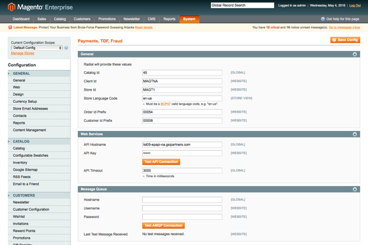
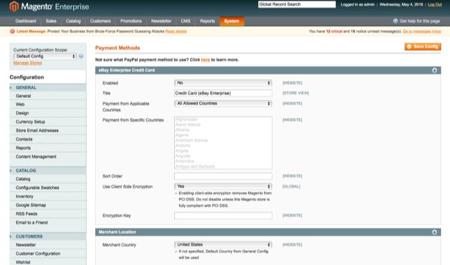

# magento ptf

## Installation

> The Radial Payments, Tax, and Fraud (PTF) extension is installed with [Composer](https://getcomposer.org/) and deployed to your Magento project directory with [Magento Composer Installer](https://github.com/Cotya/magento-composer-installer).

> To install the last stable release copy the [composer.json](composer.json) file into a **non-public directory** on your base Magento installation. 

> Now run the following command:

`composer install`

> The output should look something like this:

<pre>
./composer.json has been created
Loading composer repositories with package information
Updating dependencies (including require-dev)
  - Installing psr/log (1.0.0)
    Loading from cache

  - Installing symfony/polyfill-mbstring (v1.1.1)
    Loading from cache

  - Installing symfony/console (v2.8.5)
    Loading from cache

... more output ...

Writing lock file
Generating autoload files
please define your magento root dir [root]
Autoloader patch to root/app/Mage.php was applied successfully
</pre>

> You will be prompted to define your Magento root, you should provide the root of your Magento installation.

> Why composer-based installation?  The Radial PTF extension leverages a number of open-source extensions to accomplish its goal, you can see them listed out in the composer output or later in your composer.lock file.  Composer is the easiest way to ensure that an installation of Magento contains all these dependencies for Radial PTF to function correctly.  

## Configuration

> The Radial PTF extension does not function unless it is a) configured and b) linked to an active account for accessing Radial's Public API's.  

> Step 1 - Rename the app/etc/rom.xml.sample file to rom.xml - make sure you clear any caches running on the store

> Step 2 - Log into Admin > System > Configuration > Radial - Payments, Tax, Fraud

> Step 3 - Your Radial Technical contact will provide you with the information needed to complete these fields

> 

> Step 4 - Start using Radial Credit Card Processing as an active Payment Method in Magento - in Admin > System > Configuration > Payment Methods select the eBay Enterprise Credit Card header and set Enabled to Yes

> 

> Please remember to cache-clear after setting up data in Magento admin...

## Sign Up for Radial API Access

information coming soon...
