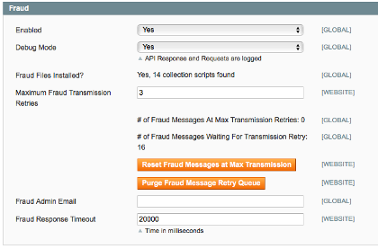
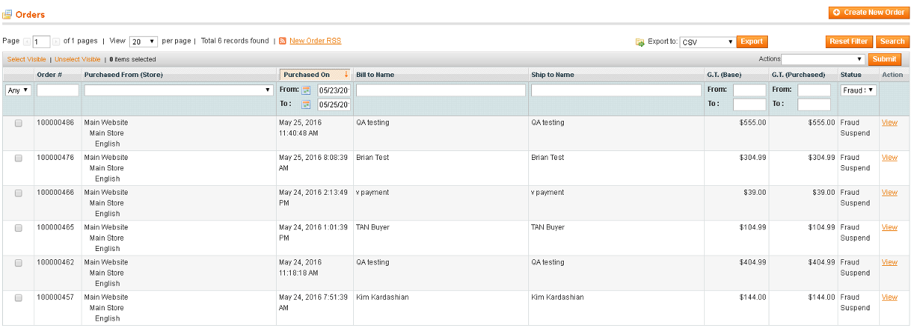

# Radial Magento Payments Tax Fraud Extension 

## Contents
  * [Enabling Fraud Processing](#enabling-fraud-processing)
  * [Recommended Reports](#recommended_reports)

## Enabling Fraud Processing

Go to System > Configuration > Radial - Payments, Tax, Fraud and select the Fraud tab and set "Enabled" to Yes.

Some other settings of note:

- Fraud Files Installed?: this is a sanity-check report to ensure that Radial's needed JavaScript files are actually loaded on the deployed-to server
- Debug Mode: Should be set to "No" at all times and only set to "Yes" if one is actively debugging fraud integration with Radial.  Turning this on will send much of the fraud messaging to the store's system.log.
- Maximum Fraud Transmission Retries: The number of times the Radial PTF extension will attempt to retry an operation involving transmitting fraud data to Radial (higher numbers will increase communication success rates, lower numbers will tie up the system less - recommendation default is 3)
- Fraud Admin Email: An email address / distribution list to use for notifying an administrator of a problem relating to fraud processing
- Fraud Response Timeout: Number of milliseconds each Radial Fraud communication operation is allowed before timing out (higher numbers will increase communication success rates, lower numbers will tie up the system less - recommendation default is 20000)

Additionally in this tab there is some informational reporting:

 - "# of Fraud Messages At Max Transmission Retries": indicates the number of fraud messages which have reached their maximum number of retries and will not be retried unless an admin clicks the "Reset Fraud Messages at Max Transmission" - clicking that button will force those messages to go through a full set of retries (as defined by the Maximum Fraud Transmission Retries field).  Errors in transmission that cause this count to increase should also result in emails going to the Fraud Admin Email that is specified.  Small numbers accumulating here can often be addressed by clicking the Reset Fraud Messages at Max Transmissions button.  Admins should only click on the Purge Fraud Message Retry Queue if instructed by Radial support.
 - "# of Fraud Messages Waiting for Transmission Retry": this indicates the number of messages in the process of being retried.  In and of itself, a number greater than 0 here does not necessarily indicate a problem. 

## Recommended Reports

Since fraud processing can be an integral part of the order fulfillment lifecycle, it is important to check on its health from time to time.  The easiest way to do this is via existing Admin by going to Sales > Orders > and then defining some filter characteristics - in the below example, a date range of several days ago was provided filtered on the order status "Fraud Suspended" to see if there are orders lingering too long in a processing state.  

## Next Docs

[Main](../README.md)

[Installation And Upgrading](INSTALL.md)

[Integrators Guide](SI.md)

[Troubleshooting](SUPPORT.md)
