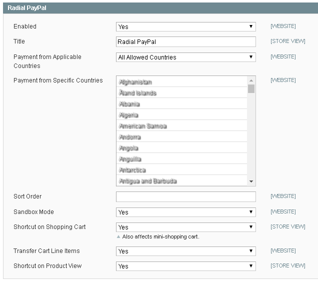

# Radial Magento Payments Tax Fraud Extension 

## Contents
  * [Enabling Credit Card Processing](#enabling-credit-card-processing)
  * [Enabling PayPal Processing](#enabling-paypal-processing)

## General Payments Settings

- Maximum Payments Transmission Retries: The number of times the Radial PTF extension will attempt to retry an operation involving transmitting Payments data to Radial (higher numbers will increase communication success rates, lower numbers will tie up the system less - recommendation default is 3)
- Payments Admin Email: An email address / distribution list to use for notifying an administrator of a problem
- Payments Response Timeout: Number of milliseconds each Radial Payments communication operation is allowed before timing out (higher numbers will increase communication success rates, lower numbers will tie up the system less - recommendation default is 20000)

Additionally in this tab there is some informational reporting:

 - "# of Payments Messages At Max Transmission Retries": indicates the number of payments messages which have reached their maximum number of retries and will not be retried unless an admin clicks the "Reset Payments Messages at Max Transmission" - clicking that button will force those messages to go through a full set of retries (as defined by the Maximum Payments Transmission Retries field).  Errors in transmission that cause this count to increase should also result in emails going to the Payments Admin Email that is specified.  Small numbers accumulating here can often be addressed by clicking the Reset Payments Messages at Max Transmissions button.  Admins should only click on the Purge Payments Message Retry Queue if instructed by Radial support.
 - "# of Payments Messages Waiting for Transmission Retry": this indicates the number of messages in the process of being retried.  In and of itself, a number greater than 0 here does not necessarily indicate a problem. 

## Enabling Credit Card Processing

To start using Radial Credit Card Processing as an active Payment Method in Magento - go to Admin > System > Configuration > Payment Methods select the eBay Enterprise Credit Card header and set Enabled to Yes

Some other settings of note:

- Title: What appears on the checkout payments page describing this payment option
- Payment from Applicable Countries: if this payment method is allowed from only certain countries, change "All Allowed Countries" to "Specific Countries" and then select the desired countries from the list below.
- Encryption Key: A field to input the Client Side Encryption Key (CSE) - please note that Radial must provide this encryption key.  
- CSE Encryption Algorithm: Leave at default value unless otherwise instructed by Radial support
- Pass After AVS Response
- AVE Failure Response Display
- AVSCSC Failure Response Display
- CSC Failure Display
- Pass After DECLF Response
- DECLF Failure Response Display
- Pass After DECL Response
- DECL Failure Response Display

Once done, click Save Config and, if necessary, clear cache.

## Enabling PayPal Processing

To start using Radial PayPal Processing as an active Payment Method in Magento - go to Admin > System > Configuration > Payment Methods select the eBay Enterprise PayPal header and set Enabled to Yes

Some other settings of note:

- Title: What appears on the checkout payments page describing this payment option
- Payment from Applicable Countries: if this payment method is allowed from only certain countries, change "All Allowed Countries" to "Specific Countries" and then select the desired countries from the list below.
- Sandbox Mode: Should be set to "Yes" for any non-production environments to prevent actual transaction processing at PayPal (i.e. developer Sandboxes, testing systems, etc...); should be set to "No" for live storefronts that need to conduct real PayPal transactions.
- Shortcut On Shopping Cart: Enables an option on the cart page to finish checkout via PayPal
- Shortcut on Product Page: Enables an option on the product page to finish checkout via PayPal 

## Next Docs

[Main](../README.md)

[Installation And Upgrading](INSTALL.md)

[Integrators Guide](SI.md)

[Troubleshooting](SUPPORT.md)
