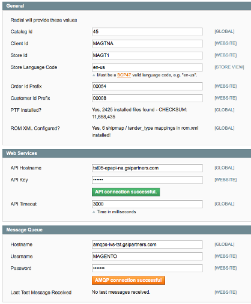
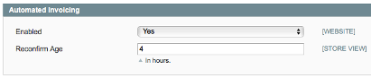
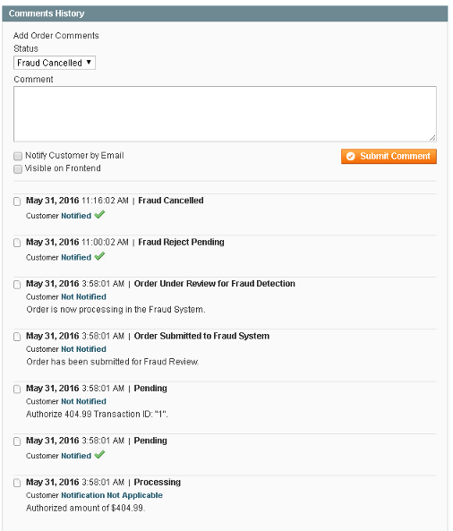

# Radial Magento Payments Tax Fraud Extension 

## Contents
  * [Admin Console Setup and Configuration](#admin-console-setup-and-configuration)
  * [Setting Up Automated Invoicing](#setting-up-automated-invoicing)
  * [Disabling Radial PTF](#disabling-radial-payment-methods-and-fraud-processing)
  * [Setting Up Extension Cron Jobs](#setting_up_extension_cron_jobs)

## Admin Console Setup and Configuration

This document covers admin setup information about the Radial PTF Extension.  Once the initial configuration is done in Admin, there are supplemental documents detailing setup for [payment processing](PAYMENT_SETUP.md), [fraud processing](FRAUD_SETUP.md), and [tax processing](TAXES_SETUP.md) - please see those documents for more details once initial setup is completed.

The Radial PTF extension does not function unless it is a) configured and b) linked to an active account for accessing Radial's Public API's.  The following steps are required before anything can be done to enable/activate payment, tax, or fraud processing at Radial.

Step 1 - Rename the app/etc/rom.xml.sample file to rom.xml - make sure you clear any caches running on the store.  See [Integrators Guide](SI.md) for other potential edits needed to this file. 

Step 2 - Log into Admin > System > Configuration > Radial - Payments, Tax, Fraud

Step 3 - Your Radial Technical contact will provide you with the information needed to complete these fields

Please be sure to test API and AMQP connectivity before proceeding to any other steps.  If this connectivity is not working, that must be resolved before anything else is done.

Assuming all fields and entered and the connectivity test buttons work correctly, save the configuration and, if applicable, clear cache.  

## Setting Up Extension Cron Jobs

There are two cron jobs packaged with the Radial PTF extension:

### radial\_eb2cfraud\_retry\_sendevent
The radial\_eb2cfraud\_retry\_sendevent job resends Fraud evaluations which failed to be transmitted on initial order submission; the default cron mask is set to run once a minute as any orders which fail to be transmitted on order submit should get to Radial fraud processing as quickly as possible.    

### radial\_amqp\_runner\_process\_queues
The radial\_amqp\_runner\_process\_queues job is responsible for checking for and retrieving fraud evaluations from Radial - these determines are processed and update order states based on the incoming data. It is recommended that this cron mask be set to run no more than every 5 minutes (the default setting) to ensure timely processing of orders (most fraud determinations are made in well under 5 minutes).

While these cron jobs are set to a cron *schedule* as part of the default installation, it is important to ensure that cron is actually set up and running for that schedule to work.  Default cron schedules can also be overridden if needed via any of the oft-used cron management extensions available (such as AOE Scheduler - https://github.com/AOEpeople/Aoe_Scheduler).  Please remember to cache-clear after setting up data in Magento admin when making adjustments to cron schedules.

## Setting Up Automated Invoicing

What is Automated Invoicing?

By default, the Radial PTF Extension leverages built in Magento order fulfillment workflow processing - while this works very well for businesses that use Magento "soup to nuts" for all aspects of order taking and fulfillment, many businesses have a warehouse running on a non-Magento system (i.e. a Warehouse Management System or WMS) and use feeds and webservices to integrate between Magento and this WMS.  The Automated Invoicing Feature allows the Radial PTF extension to watch for shipments to be applied to orders to initiate credit settlement activities instead of relying on internal Magento workflow.  So, if a warehouse system is already sending feeds to Magento to give Magento shipment information on orders which have been picked, packed and shipped, the Automated Invoicing feature will allow settlement to be initiated on what was fulfilled.

To use automated invoicing, log into Admin > System > Configuration > Radial - Payments, Tax, Fraud and expand the Automated Invoicing tab:

Set Enabled to Yes, Save, and clear cache - this will enable Automated Invoicing.

Reconfirm Age - when not using Automated Invoicing, the Radial PTF extension will perform a confirm funds check on an order when it is being shipped to ensure funds are still available from a previous authorization immediately prior to shipping.  When Magento is integrated into a Warehouse system, that check cannot happen since Magento is not involved with the final shipment; as such, the Reconfirm Age field is used to specify how many hours old an order can be before running a confirm funds check as part of the fraud release process.  So if Reconfirm Age is set to 4 hours and it takes more than 4 hours to get to a ready to ship state, the Radial PTF extension will confirm funds on the order before letting it get to a ready to ship state.

# Disabling Radial Payment Methods and Fraud Processing

If there is a need to temporarily disable Radial Payment and/or Fraud processing, both can be shut off via Magento Admin using the below steps.  Please note: If Radial Credit Card and PayPal are disabled, another payment method will need to be enabled otherwise the storefront will have no configured means of paying for an order and customers will not be able to checkout.

To stop using Radial Credit Card Processing as an active Payment Method in Magento - go to Admin > System > Configuration > Payment Methods select the eBay Enterprise Credit Card header and set Enabled to No.  Save and clear cache.

To stop using Radial PayPal Processing as an active Payment Method in Magento - go to Admin > System > Configuration > Payment Methods select the eBay Enterprise PayPal header and set Enabled to No.  Save and clear cache.

To disable Radial Fraud Processing, go to System > Configuration > Radial - Payments, Tax, Fraud and select the Fraud tab and set "Enabled" to No.  Save and clear cache.

## Order Event Logging

All Radial Payments and Fraud processing activities log to the Comments History section of an order's Information tab (found in Admin > Sales > Orders > select specific order).  Below is an example:

Here you see an order which with Credit Card authorized for a $404.99 transaction, was sent to fraud processing, and then was rejected during fraud evaluation.  Anytime additional details are needed about how Radial processed a transaction, consult the Comments History.

## Next Docs

[Main](../README.md)

[Installation And Upgrading](INSTALL.md)

[Integrators Guide](SI.md)

[Troubleshooting](SUPPORT.md)
