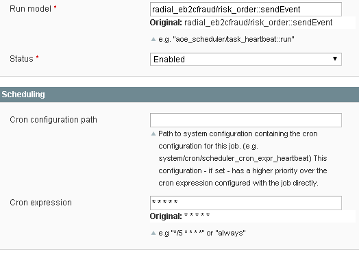

[](http://www.radial.com/)

# Radial Magento Payments Tax Fraud Extension 

## Contents
  * [Admin Console Setup and Configuration](#admin-console-setup-and-configuration)
  * [Enabling Credit Card Processing](#enabling-credit-card-processing)
  * [Enabling PayPal Processing](#enabling-paypal-processing)
  * [Enabling Fraud Processing](#enabling-fraud-processing)
  * [Disabling Radial Payment Methods and Fraud Processing](#disabling-radial-payment-methods-and-fraud-processing)
  * [Setting Up Extension Cron Jobs](#setting_up_extension_cron_jobs)
  * [Recommended Reports](#recommended_reports)

## Admin Console Setup and Configuration

The Radial PTF extension does not function unless it is a) configured and b) linked to an active account for accessing Radial's Public API's.  These first three steps are required before anything can be done to enable/activate payment, tax, or fraud processing at Radial.

Step 1 - Rename the app/etc/rom.xml.sample file to rom.xml - make sure you clear any caches running on the store.  See [Integrators Guide](SI.md) for other potential edits needed to this file. 

Step 2 - Log into Admin > System > Configuration > Radial - Payments, Tax, Fraud

Step 3 - Your Radial Technical contact will provide you with the information needed to complete these fields


Please be sure to test API and AMQP connectivity before proceeding to any other steps.  If this connectivity is not working, that must be resolved before anything else is done.

Assuming all fields and entered and the connectivity test buttons work correctly, save the configuration and, if applicable, clear cache.  

## Enabling Credit Card Processing

To start using Radial Credit Card Processing as an active Payment Method in Magento - go to Admin > System > Configuration > Payment Methods select the eBay Enterprise Credit Card header and set Enabled to Yes


Some other settings of note:

- Title: What appears on the checkout payments page describing this payment option
- Payment from Applicable Countries: if this payment method is allowed from only certain countries, change "All Allowed Countries" to "Specific Countries" and then select the desired countries from the list below.
- Use Client Side Encryption: If client side encryption is being used, set Use Client Side Encryption to "Yes" - this will make a new field appear to input the encryption key - please note that Radial must provide this encryption key.  

Once done, click Save Config and, if necessary, clear cache.

## Enabling PayPal Processing

To start using Radial PayPal Processing as an active Payment Method in Magento - go to Admin > System > Configuration > Payment Methods select the eBay Enterprise PayPal header and set Enabled to Yes


Some other settings of note:

- Title: What appears on the checkout payments page describing this payment option
- Payment from Applicable Countries: if this payment method is allowed from only certain countries, change "All Allowed Countries" to "Specific Countries" and then select the desired countries from the list below.
- Sandbox Mode: Should be set to "Yes" for any non-production environments to prevent actual transaction processing at PayPal (i.e. developer Sandboxes, testing systems, etc...); should be set to "No" for live storefronts that need to conduct real PayPal transactions.
- Shortcut On Shopping Cart: Enables an option on the cart page to finish checkout via PayPal
- Shortcut on Product Page: Enables an option on the product page to finish checkout via PayPal 

## Enabling Fraud Processing

Go to System > Configuration > Radial - Payments, Tax, Fraud and select the Fraud tab and set "Enabled" to Yes.


Some other settings of note:

- Fraud Files Installed?: this is a sanity-check report to ensure that Radial's needed JavaScript files are actually loaded on the deployed-to server
- Debug Mode: Should be set to "No" at all times and only set to "Yes" if one is actively debugging fraud integration with Radial.  Turning this on will send much of the fraud messaging to the store's system.log.

## Setting Up Extension Cron Jobs

There are two cron jobs packaged with the Radial PTF extension:

### radial\_eb2cfraud\_retry\_sendevent
The radial\_eb2cfraud\_retry\_sendevent job resends Fraud evaluations which failed to be transmitted on initial order submission.    

### radial\_amqp\_runner\_process\_queues
The radial\_amqp\_runner\_process\_queues job is responsible for checking for and retrieving fraud evaluations from Radial - these determines are processed and update order states based on the incoming data.

### radial\_payments\_retry\_settlements
The radial\_payments\_retry\_settlements job retransmits any settlement communications that failed in their initial posting back to Radial.  

While these cron jobs are set to a cron *schedule* as part of the default installation, it is important to ensure that cron is actually set up and running for that schedule to work.  Default cron schedules can also be overridden if needed via any of the oft-used cron management extensions available (such as AOE Scheduler - https://github.com/AOEpeople/Aoe_Scheduler).  Please remember to cache-clear after setting up data in Magento admin when making adjustments to cron schedules.

Example of setting an override cron expression in AOE scheduler:



Enabling Cron Groups and running seperate cron processes to include / exclude the group will ensure that the cronjobs in the Radial PTF Extensions are non-blocking:

<pre>
```xml
<crontab>
    <jobs>
        <radial_eb2cfraud_retry_sendevent>
        ...
            <groups>radial<groups>
        </radial_eb2cfraud_retry_sendevent>
    </jobs>
</crontab>
</pre>
```

Example crontab entries:

<pre>
* * * * * ! test -e /var/www/magento/maintenance.flag && /bin/bash /var/www/magento/scheduler_cron.sh --mode default --includeGroups radial
* * * * * ! test -e /var/www/magento/maintenance.flag && /bin/bash /var/www/magento/scheduler_cron.sh --mode default --excludeGroups radial
</pre>

## Disabling Radial Payment Methods and Fraud Processing

If there is a need to temporarily disable Radial Payment and/or Fraud processing, both can be shut off via Magento Admin using the below steps.  Please note: If Radial Credit Card and PayPal are disabled, another payment method will need to be enabled otherwise the storefront will have no configured means of paying for an order and customers will not be able to checkout.

To stop using Radial Credit Card Processing as an active Payment Method in Magento - go to Admin > System > Configuration > Payment Methods select the eBay Enterprise Credit Card header and set Enabled to No.  Save and clear cache.

To stop using Radial PayPal Processing as an active Payment Method in Magento - go to Admin > System > Configuration > Payment Methods select the eBay Enterprise PayPal header and set Enabled to No.  Save and clear cache.

To disable Radial Fraud Processing, go to System > Configuration > Radial - Payments, Tax, Fraud and select the Fraud tab and set "Enabled" to No.  Save and clear cache.

Additionally, for fully disabling all interactions with Radial, disable the following cron jobs:

- radial\_eb2cfraud\_retry\_sendevent 
- radial\_amqp\_runner\_process\_queues 
- radial\_payments\_retry\_settlements

## Order Event Logging

All Radial Payments and Fraud processing activities log to the Comments History section of an order's Information tab (found in Admin > Sales > Orders > select specific order).  Below is an example:


Here you see an order which with Credit Card authorized for a $404.99 transaction, was sent to fraud processing, and then was rejected during fraud evaluation.  Anytime additional details are needed about how Radial processed a transaction, consult the Comments History.

## Recommended Reports

Since fraud processing can be an integral part of the order fulfillment lifecycle, it is important to check on its health from time to time.  The easiest way to do this is via existing Admin by going to Sales > Orders > and then defining some filter characteristics - in the below example, a date range of several days ago was provided filtered on the order status "Fraud Suspended" to see if there are orders lingering too long in a processing state.  


## Next Docs

[Main](../README.md)

[Installation And Upgrading](INSTALL.md)

[Integrators Guide](SI.md)

[Troubleshooting](SUPPORT.md)
