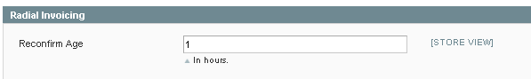

# Radial Magento Payments Tax Fraud Extension 

## Contents
  * [Setting Up Shipping Methods](#setting_up_shipping_methods)
  * [Sign Up for Radial API Access](#sign_up_for_radial_api_access)
  * [Order Management and Fraud States](#order_management_and_fraud_states)
  * [Adding Auto-Invoicing / Settlement](#adding_auto_invoicing)

## Setting Up Shipping Methods

Radial's Fraud Engine needs to understand what ship methods are being used in a storefront to provide accurate fraud assessments (i.e. Next Day Air, Ground, etc...) as this information is passed back to Radial; since different Magento installations tend to articulate these shipping codes differently from each other, a map needs to be maintained to help Radial's Fraud Engine properly understand the shipping codes being used.  This mapping is created in <magento_install\>/app/etc/rom.xml (rom.xml.sample is provided as part of the installation of the Radial extension):

        <radial_core>
            <!--
            Shipping Codes: Map Magento shipping methods to ROM shipping codes. Node names must match Magento shipping
            methods. Values must match ROM shipping codes specific to your client implementation, which Radial
            will provide to you.
            -->
            <shipmap>
                <flatrate_flatrate>ANY_STD</flatrate_flatrate>
            </shipmap>
        </radial_core>

Since there is no place in admin which tells you what your active shipping codes are, the following script will give you a dump of what your available ship methods are:

	<?php
	chdir(dirname(__FILE__));
	require 'app/Mage.php';
	Mage::init('admin');
	$methods = Mage::getSingleton('shipping/config')->getActiveCarriers();
	foreach($methods as $_ccode => $_carrier) {
	    if($_methods = $_carrier->getAllowedMethods())  {
	        foreach($_methods as $_mcode => $_method)   {
	                $_code = $_ccode . '_' . $_mcode;
	                echo $_code."\n";
	        }
	    }
	}
	?>

Save that script to a file shipping-codes.php and run from your Magento install directory ("php shipping-codes.php") and it should give you a list of what's active for your install - for example:

	$ php shipping-codes.php
	
	flatrate_flatrate
	fedex_EUROPE_FIRST_INTERNATIONAL_PRIORITY
	fedex_FEDEX_1_DAY_FREIGHT
	fedex_FEDEX_2_DAY_FREIGHT
	fedex_FEDEX_2_DAY
	fedex_FEDEX_2_DAY_AM
	fedex_FEDEX_3_DAY_FREIGHT
	fedex_FEDEX_EXPRESS_SAVER
	fedex_FEDEX_GROUND
	fedex_FIRST_OVERNIGHT
	fedex_GROUND_HOME_DELIVERY
	fedex_INTERNATIONAL_ECONOMY
	fedex_INTERNATIONAL_ECONOMY_FREIGHT
	fedex_INTERNATIONAL_FIRST
	fedex_INTERNATIONAL_GROUND
	fedex_INTERNATIONAL_PRIORITY
	fedex_INTERNATIONAL_PRIORITY_FREIGHT
	fedex_PRIORITY_OVERNIGHT
	fedex_SMART_POST
	fedex_STANDARD_OVERNIGHT
	fedex_FEDEX_FREIGHT
	fedex_FEDEX_NATIONAL_FREIGHT

Use these codes to map up to Radial-supported shipping codes in rom.xml using the syntax:

	<STORE_SHIPPING_CODE>RADIAL_SHIPPING_CODE</STORE_SHIPPING_CODE>

	for example:
    
	<flatrate_flatrate>ANY_STD</flatrate_flatrate>

	Which maps "flatrate_flatrate" to "ANY_STD" in all fraud data sent to Radial

After creating the export of available shipping methods, please work with your Radial team to determine the best corresponding Radial shipping codes to map to in rom.xml.

Please coordinate with your Radial team to ensure that correct ship method mappings are established and tested.

## Sign Up for Radial API Access

For access to Radial API's, please see [Radial.com](http://www.radial.com/) for more information...

## Order Management and Fraud States

Rolling out Radial Fraud processing involves making some important modifications to order fulfillment.  In a traditional model, orders are received and filled; Radial fraud processing sits in the middle of order received and order fulfillment to provide a recommendation on whether an order is fraudulent before filling.  Now, orders are received, fraud evaluated, and filled if fraud approved, which means that the fulfillment process needs to understand when fraud evaluation is completed - to accomplish this, the Radial Fraud extension introduces some new order statuses to reflect different stages of processing.  

New order statuses include (with their Magento order status codes and descriptions of meaning):

- Fraud Accepted ('risk_accept'): Order has been evaluated and determined to be non-fraudulent
- Order Submitted to Fraud System ('risk_submitted'): Order data has been submitted to the Radial fraud engine for evaluation
- Order Under Review for Fraud Detection ('risk_processing'): Order is currently under review
- Order Has NOT been transmitted to Fraud ('risk_retrysubmit'): Order has not been successfully sent to Radial, retrying
- Fraud Cancelled ('risk_cancel'): Order has been determined to be fraudulent and should be canceled.  
- Fraud Ignore ('risk_ignore'): Fraud engine is ignoring the order due to setup on Radial side
- Fraud Suspend ('risk_suspend'): Order is undergoing extended evaluation 
- Fraud Reject Pending('risk_rejectpending'): Indicating that there is a high likelihood of imminent rejection of the order

In the end, each order state is a *recommendation* for handing the order (with the exception of Fraud Cancels which literally cancels the order in Magento) - business needs can override the processing and fill the order if and when needed.  Each storefront has to adopt a process around how it handles each status in fraud processing.  This often entails:

1. Updating feeds jobs which send order data to a fulfillment center which might currently send everything based on payment authorization, but now may want to wait for a risk_accept status to come in.
2. Train internal staff responsible for fulfilling orders to ensure that they adhere to the process and only fulfill orders in these newer statuses.

Work with your Magento SI to adjust any feeds / cron jobs which base themselves off of order status so that they only pick up orders in an appropriate/desired state

## Adding Auto Invoicing

Since many businesses do not process orders manually in Magento Admin, an additional extension is available that can be added to the Radial PTF installation which automates post-order submission payment processing.  Once installed, this extension takes orders which have been processed through Fraud and puts them in a state of "Ready to Ship".  If sufficient time has passed during fraud processing, the extension will automatically perform a confirm funds call back to Radial to confirm funds are still available to process the order.  Additionally, the extension will automatically initiate settlement on the portion of an order shipped when a shipment is logged into Magento.  This helps make the payment processing of an order not dependent on a human in the Admin UI performing manual actions.

There is only one configuration setting in Admin for Auto Invoicing under System > Configuration > Radial - Payments, Tax, Fraud > Radial Invoicing:

To add the Auto Invoicing component to Radial PTF, please add the following line to your composer.json's require block:

For example:

	{
	  "name": "radial/magento-ptf-build",
	  "require": {
	    "magento-hackathon/magento-composer-installer": "~2.1",
	    "radial/magento-fraud-risk": "1.0.36",
	    "radial/magento-payments" : "1.0.14",
	  },
	  "extra": {
	    "magento-deploystrategy": "copy",
	    "magento-force": true,
	    "magento-root-dir": "/var/www/magento"
	  },
	  "repositories": [
	    { "type": "composer", "url": "https://packages.firegento.com/" }
	  ]
	}

Please remember to add the comma at the end of the previous line.

Then run composer update and the extension will be installed.

## Next Docs

[Main](../README.md)

[Installation And Upgrading](INSTALL.md)

[Setup and Configuration](SETUP.md)

[Troubleshooting](SUPPORT.md)

