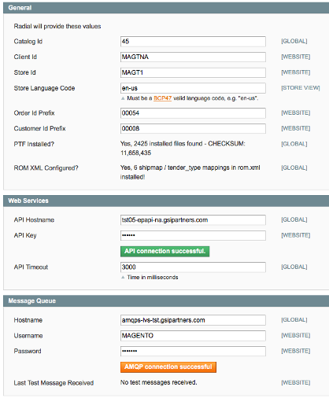

# Radial Magento Payments Tax Fraud Extension 

## Troubleshooting

### Testing Connection to API Fails

If testing reports "API connection failed.  Invalid API Key":
> This indicates that an invalid or incomplete API key has been entered into the admin panel for the API Key field.  Please verify that you are attempting to input the entire / correct API key from Radial and, if so,  contact Radial to confirm the API key.

If testing reports "API connection failed.  Invalid hostname":
> This indicates that an incorrect or incomplete hostname has been entered in the API Hostname field.  Please verify that you are attempting to enter the entire / correct hostname in the API Hostname field and, if so, contact Radial to confirm the hostname.

It is important to note that the invalid hostname error may indicate a lack of network connectivity between the Magento app server and Radial's public API endpoint.  If the correct hostname is being entered and validation is still failing, it is entirely possible that connectivity to the host via port 443 has been blocked and that that is the root cause for the test failure.  Ensure that connectivity via port 443 to Radial systems exists from the Magento system - please note that if you are running a cluster of Magento servers, they must *all* be able to connect via port 443.

### Testing Connection to AMQP Fails

If testing reports "No queues configured":
> Make sure you have moved the <magento_install\>/app/etc/rom.xml.sample file to <magento_install\>/app/etc/rom.xml.  

If testing reports "AMQP connection failed":
> Please reconfirm the username, password and hostname with information provided from Radial; if the test continues to fail, please reconfirm the configuration entries with Radial.

This error may also indicate a lack of network connectivity between the Magento app server and Radial's systems.  If the correct hostname and credentials are being entered and validation is still failing, it is entirely possible that connectivity to the host via port 443 has been blocked and that that is the root cause for the test failure.  Ensure that connectivity via port 443 to Radial systems exists from the Magento system - please note that if you are running a cluster of Magento servers, they must *all* be able to connect via port 443.

### Radial Credit Cards/PayPal not showing on Payment Information page in Checkout

1. Make sure System > Configuration > Sales > Payment Methods has eBay Enterprise Credit Card Enabled set to "Yes" - see [Setup and Configuration](SETUP.md) for more information
2. If your Magento installation is utilizing a caching extension (for example, the out of the box Enterprise Edition caches), make sure you flush all caches and recheck the Payment Options page in checkout
3. Note that if you are switching from another payments provider to Radial, you may want to temporarily set the Titles for Credit Card and PayPal to something distinctive to ensure that the correct payment provider's extension is being loaded.

### After loading the Radial extension there are now multiple credit card selection elements on the Payment Information page in Checkout

This is typically due to having multiple payment processors active under System > Configuration > Sales > Payment Methods.  After loading and activating the Radial payment options, you would normally deactivate the other options.

### PayPal is not showing up on the cart or product page

Go to System > Configuration > Sales > Payment Method > eBay Enterprise PayPal and make sure "Shortcut on Shopping Cart" and "Shortcut on Product View" are both set to "Yes".  Additionally, make sure to flush any caches before rechecking.

### There is nothing under System > Configuration > Radial > Payments, TDF, Fraud

This would indicate that the extension is not loaded correctly or at all.  Check to see if there are any files under <magento_install\>/app/code/community/Radial and <magento_install\>/vendor/radial - if either or both of those Radial directories are missing, that would indicate that the core install process was not successfully completed.  Please review the installation steps under [Installation And Upgrading](INSTALL.md) and coordinate with Radial for next steps if there continue to be problems.

### Eveything appears to be working, but submitting orders fails
There could be a variety of reasons for this and you should always check the logs in this case, but you may want to first check to see if there are loaded ship maps in rom.xml - go under System > Configuration > Radial > Payments, TDF, Fraud and look under the general tab:

The section showing "ROM.XML Configured?" should show that there are shipmaps and tender types defined.  If it says there are not, try clearing cache and going back to this screen.  If it still says there aren't any shipmaps defined, the installation probably has a missing or malformed rom.xml file - please see [Setup and Configuration](SETUP.md) "Step 1 - Rename the app/etc/rom.xml.sample file to rom.xml" and 
[Integrators Guide](SI.md) "Setting Up Shipping Methods" for more information about making sure your rom.xml is set up and configured correctly.  

## Next Docs

[Main](../README.md)

[Installation And Upgrading](INSTALL.md)

[Setup and Configuration](SETUP.md)

[Integrators Guide](SI.md)

