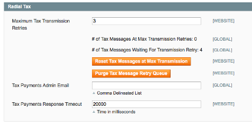

# Radial Magento Payments Tax Fraud Extension 

## Contents
  * [Enabling Tax Processing](#enabling-tax-processing)
  * [Setting a Shipping Origin](#setting_a_shipping_origin)
  * [Notes About Taxes in Magento](#notes-about-taxes-in-magento)
  * [Taxes on Gifting Options, Warranties, Customization, and Shipping Taxes](taxes_on_gifting_options_warranties_customization_and_shipping_taxes) 

## Enabling Tax Processing

To start using Radial Tax Processing go to Admin > System > Configuration > Radial Payments, Tax, Fraud under the Radial Tax tab and set Enabled to Yes.

There are a number of configuration options available from this tab, including:

- Maximum Tax Transmission Retries: Indicates that number of times to retry a tax operation calling back to Radial (higher numbers will increase communication success rates, lower numbers will tie up the system less - recommendation default is 3)
- Tax Payments Admin Email: An email address / distribution list to use for notifying an administrator of a problem
- Tax Payments Response Timeout: Number of milliseconds each Radial Tax communication operation is allowed before timing out (higher numbers will increase communication success rates, lower numbers will tie up the system less - recommendation default is 20000)

Additionally in this tab there is some informational reporting:

 - "# of Tax Messages At Max Transmission Retries": indicates the number of tax messages which have reached their maximum number of retries and will not be retried unless an admin clicks the "Reset Tax Messages at Max Transmission" - clicking that button will force those messages to go through a full set of retries (as defined by the Maximum Tax Transmission Retries field).  Errors in transmission that cause this count to increase should also result in emails going to the Tax Payments Admin Email that is specified.  Small numbers accumulating here can often be addressed by clicking the Reset Tax MEssages at Max Transmissions button.  Admins should only click on the Purge Tax Message Retry Queue if instructed by Radial support.
 - "# of Tax Messages Waiting for Transmission Retry": this indicates the number of messages in the process of being retried.  In and of itself, a number greater than 0 here does not necessarily indicate a problem. 

Once done, click Save Config and, if necessary, clear cache.

## Setting a Shipping Origin

The Radial PTF extension uses the defined Shipping Origin as specified in Magento under System > Configuration > Sales > Shipping Settings > Origin.  This is typically a businesses warehouse (or primary warehouse) from which orders are shipped from.  If there a many warehouses from which products are shipped, this address would function as a default address to estimate taxes based on.   This must be set for Radial PTF to calculate taxes correctly.

Once done, click Save Config and, if necessary, clear cache.

## Notes About Taxes in Magento

Note that the Radial PTF tax functionality does not necessarily preclude other tax extensions /default tax data in Magento.  It is important that a storefront not run additional tax extensions in their Magento installation that could cause conflicts with or affect the calculations of the Radial PTF tax extension.  It is also important to not have out-of-the-box Magento tax rules in place which could similarly conflict with Radial tax calculations.

All tax calculations should be done via the Radial extension for it to work properly.  Do not try to help it with other extensions or administrative adjustments to how taxes are calculated.

## Taxes on Gifting Options, Warranties, Customization, and Shipping Taxes

In some cases, it is necessary to handle gift wraps, warranties, and other supplemental product costs with different tax classifications than the product they are tied to.  With the wide variety of extensions in the Magento Connect marketplace, it can be difficult for the Radial PTF extension to correctly determine these costs on an order - as such, the Radial PTF extension expects to handle the following scenarios in the manners described below:

-	If a product’s warranty needs to have a different tax classification than the product it is sold with, it should be merchandized as a separate product (i.e. simple or virtual) and then tied to the product it is sold with as a bundled product.  This will allow a store to set different tax classifications for a product and its warranty via normal product management screens (i.e. Catalog > Manage Products > search for product, edit, set tax information).
-	If a product’s gift wrapping needs to have a different tax classification than the product it is sold with, one of two options can be exercised:
o	Like with warranties, separate SKU’s can be created representing different gift wrapping options and then tied to the product as a bundled product
o	If using Magento Enterprise Edition, leverage the built-in gift wrapping functionality under Sales > Gift Wrapping and the Radial PTF Extension will auto-detect the use of gift wrapping in an order and apply appropriate gift wrapping tax rates as configured in the extension under System > Configuration > Radial PTF
-	For cases where a product’s gift messaging and gift carding needs to have a different tax classification than the product it is sold with, Radial will auto-detect gift messaging options when set up under a product’s Gift Options tab when editing a product and under System > Configuration > Sales > Sales > Gift Options and apply tax rates as configured in the extension under System > Configuration > Radial PTF.
-	For cases where a product’s customization (i.e. monogramming) needs to have a different tax class than the product it is customizing, a product customization tax class can be set under System > Configuration > Radial PTF which will be applied to the cost of the customization.
-	Shipping tax class is configured in the Radial extension under System > Configuration > Radial PTF
-	If any of the above options above are not utilized for handling the usecases described, the Radial PTF extension will add these supplemental product costs with the line item cost of the product and apply the product’s tax classification to the total line cost

The Radial Tax team will provide acceptable tax codes for use with gifting options.

## Next Docs

[Main](../README.md)

[Installation And Upgrading](INSTALL.md)

[Integrators Guide](SI.md)

[Troubleshooting](SUPPORT.md)
