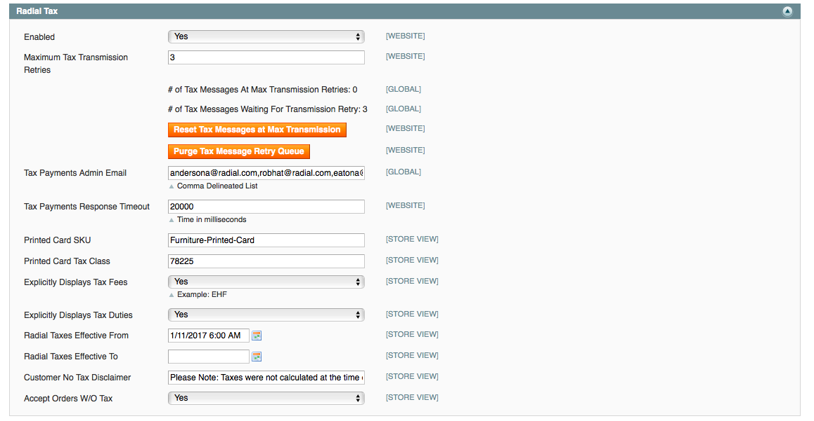

# Radial Magento Payments Tax Fraud Extension 

## Contents
  * [Enabling Credit Card Processing](#enabling-credit-card-processing)

## Enabling Tax Processing

To start using Radial Credit Card Processing as an active Payment Method in Magento - go to Admin > System > Configuration > Payment Methods select the eBay Enterprise Credit Card header and set Enabled to Yes

Some other settings of note:

- Title: What appears on the checkout payments page describing this payment option
- Payment from Applicable Countries: if this payment method is allowed from only certain countries, change "All Allowed Countries" to "Specific Countries" and then select the desired countries from the list below.
- Use Client Side Encryption: If client side encryption is being used, set Use Client Side Encryption to "Yes" - this will make a new field appear to input the encryption key - please note that Radial must provide this encryption key.  

Once done, click Save Config and, if necessary, clear cache.

## Next Docs

[Main](../README.md)

[Installation And Upgrading](INSTALL.md)

[Integrators Guide](SI.md)

[Troubleshooting](SUPPORT.md)
